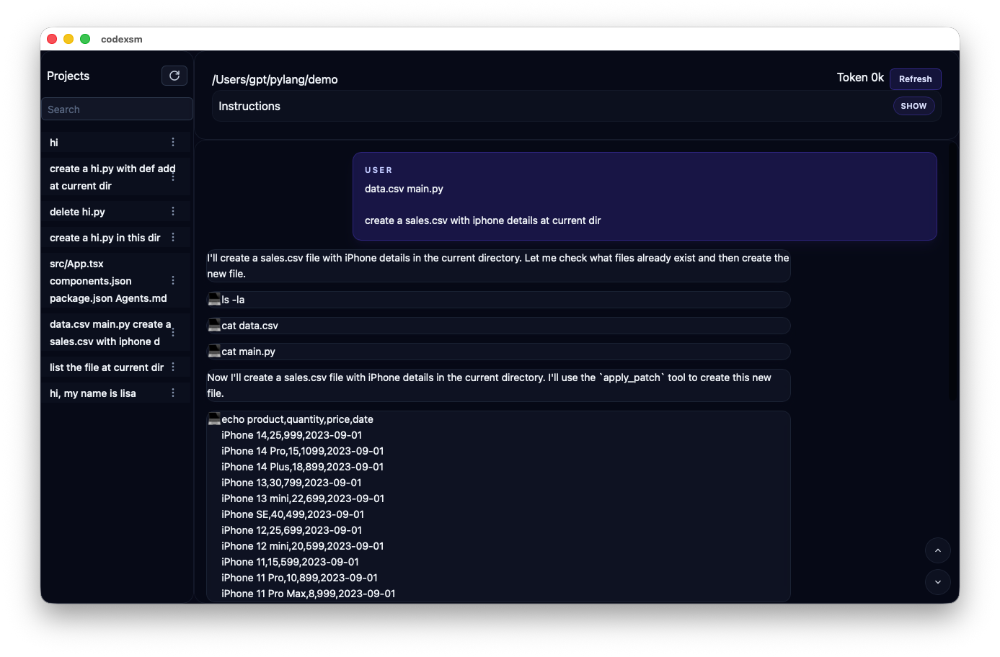

# Codex session manager

[](https://github.com/milisp/codexsm/stargazers)
[](http://x.com/intent/follow?screen_name=lisp_mi)

Codex CLI sessions manager base on project, Tauri app, view, rename, delete, one-click resume session



> [!TIP]
> **⭐ Star the repo and follow [milisp](https://github.com/milisp) on Github for more project**.

## Related project
- [Codexia](https://github.com/milisp/codexia) - A powerful GUI and Toolkit for OpenAI Codex CLI
- [Codexia-zen](https://github.com/milisp/codexia-zen) - a minimalist design GUI for OpenAI Codex CLI
- [awesome-codex-cli](https://github.com/milisp/awesome-codex-cli) - A curated list of awesome resources, tools, and tutorials for OpenAI Codex CLI

## ✨ Features

- Tauri app, lightweight cross-platform

## Tech

- Tauri
- solid-js
- tailwindcss

## Download

[release](https://milisp.github.io/modern-github-release/#/repo/milisp/codexsm)

## Build from source Prerequisites

- Tauri prerequisites: https://v2.tauri.app/start/prerequisites/

### Installation

Clone and install dependencies:
```bash
git clone https://github.com/milisp/codexsm
cd codexsm
bun install
```

Run development build:
```bash
bun tauri dev
```

Build for production:
```bash
bun tauri build
```